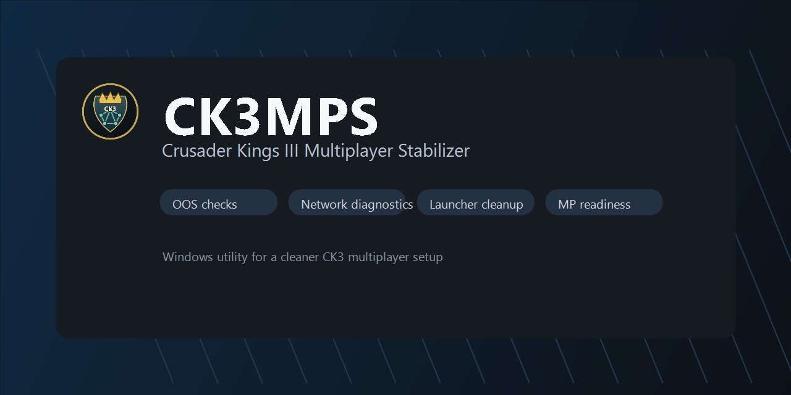
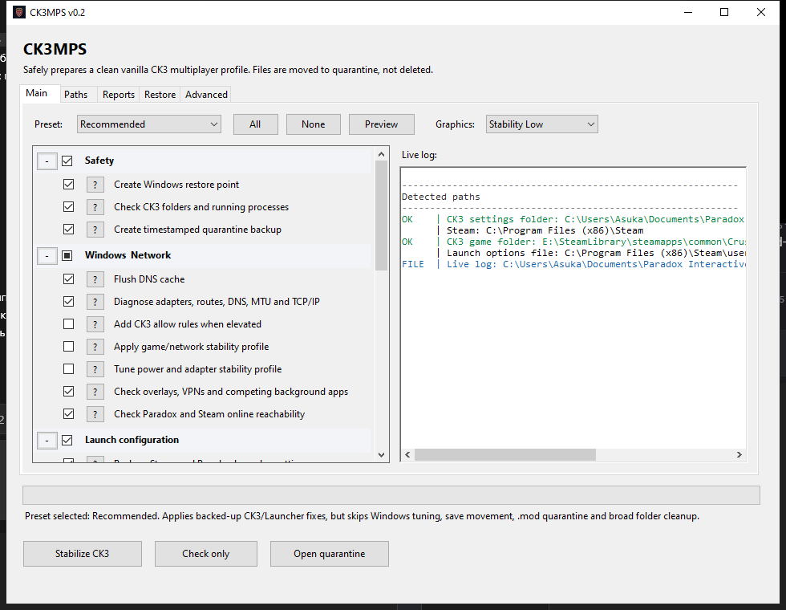
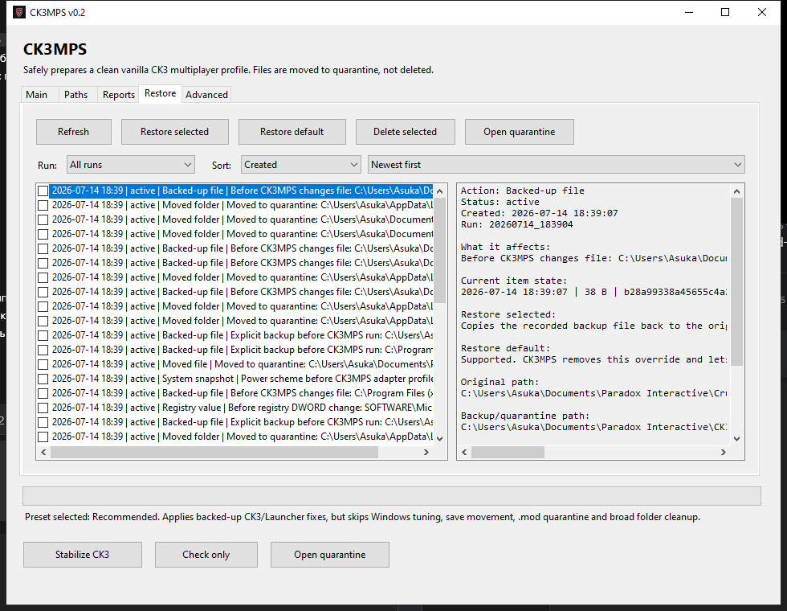
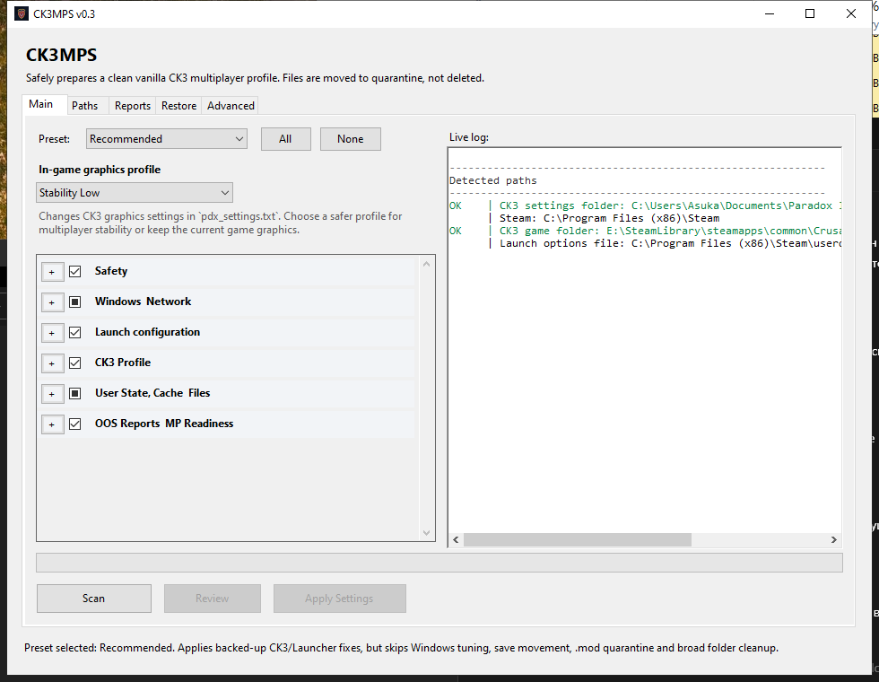
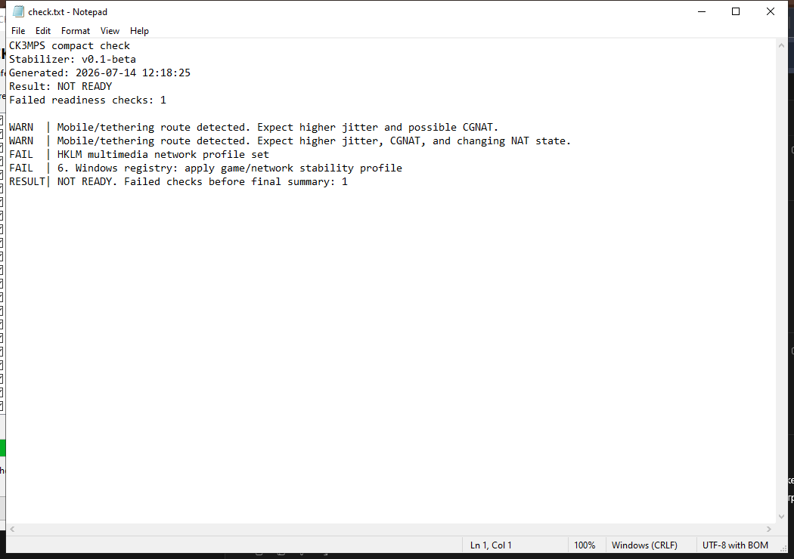

# CK3MPS



**Crusader Kings III Multiplayer Stabilizer for Windows.**

[](https://github.com/Danissemo/CK3MPS/releases)
[](https://github.com/Danissemo/CK3MPS/actions/workflows/build.yml)
[](#requirements)
[](#build)
[](LICENSE)

CK3MPS is a small Windows utility for preparing a cleaner, more predictable Crusader Kings III multiplayer environment. It focuses on reducing common OOS and connection-risk causes around CK3 user files, launcher state, Windows networking, Steam, Paradox Launcher, mods, cache, reports, workflow saves, parity checks, and runtime readiness.

[Download latest release](https://github.com/Danissemo/CK3MPS/releases/latest) |
[View package](https://github.com/Danissemo/CK3MPS/pkgs/nuget/CK3MPS) |
[Read changelog](CHANGELOG.md)

## Screenshots

| Main window | Restore |
| --- | --- |
|  |  |

| Scan | Generated report |
| --- | --- |
|  |  |

## What It Does

- Checks CK3 folders, running processes, saves, mods, reports, cache, launcher state, Steam state, Windows networking, firewall, adapter hints, VPN, PPPoE, DNS and route risks.
- Applies selected stability actions with visible progress and grouped checklist items.
- Offers practical presets: Recommended, Maximum, clean profile, network-focused and diagnostic-only flows.
- Archives OOS and crash evidence without filling the CK3 game folder with stabilizer logs.
- Writes compact reports, quarantine data, restore history and live logs to `Documents\Paradox Interactive\CK3MPS`, or to `CK3MPS_Data` next to the executable when **Portable mode** is enabled.
- Uses journaled portable-mode migration with startup recovery for interrupted state-root moves.
- Uses batch restore transactions with reverse snapshots and `restore_manifest.tsv` rollback for selected restore operations.
- Supports authenticated parity-room exchange on loopback and a selected private LAN IPv4 endpoint while preserving room code, session secret, encryption/signature, replay, payload, peer/client, and rate-limit checks.
- Keeps the release folder simple: the downloadable app is `release\CK3MPS.exe`.

## Safety

CK3MPS is built for local Windows machines and should be run intentionally.

- Run it as administrator when applying stabilization.
- Run **Scan** when you only want diagnostics and review without applying changes. Scan mode is read-only and does not create or migrate stabilizer state. Use **Export Scan Report** afterward to explicitly save the in-memory result to a location you choose.
- Keep your CK3 saves. Managed workflow saves are quarantined for recovery instead of being deleted.
- Close CK3 before applying game or launcher settings.
- Treat imported reports, saves, launcher state and restore manifests as untrusted input. Review before applying changes on shared or unusual setups.
- Review any warning in the final readiness report before starting multiplayer.
- If portable migration or restore is interrupted, reopen CK3MPS before deleting transaction data so startup/restore recovery can inspect preserved journals and snapshots.

## Data and Network Boundaries

- CK3MPS writes reports, history, quarantine data, migration journals and restore metadata only under `Documents\Paradox Interactive\CK3MPS`, or under `CK3MPS_Data` next to the executable in portable mode.
- App-owned transaction data includes `.ck3mps-state-migration`, `.ck3mps-migration-stage-*`, migration `.backup` data, `restore_transactions\*`, and `restore_manifest.tsv` snapshots.
- Workflow save actions are limited to managed `.ck3` files under the CK3 user save roots. Selected saves are duplicated atomically where the filesystem supports it, and deleted saves are moved into quarantine history.
- Directory restore uses same-parent staging/rename operations. CK3MPS does not claim atomic replacement across different filesystem volumes.
- Large save and OOS inputs are read with explicit size limits. When a text source exceeds the configured bound, CK3MPS truncates the read and marks the result.
- The parity room host listens on loopback and one selected private LAN IPv4 endpoint, not a wildcard address. Joining requires both the room code and the session secret, and payload sizes are bounded.
- LAN parity still needs a manual two-machine Windows test before release confidence because CI cannot reproduce every router, firewall, VPN, or adapter-priority setup.
- Release checks can detect newer versions, but the app only opens the official GitHub release page. Automatic unsigned updater execution is intentionally disabled.

## Requirements

- Windows 10 or Windows 11
- Crusader Kings III installed through Steam or a compatible Paradox Launcher setup
- .NET Framework 4.8 runtime
- Administrator rights for Windows/network/launcher/registry/restore changes

## Recommended Use

1. Close CK3 and Paradox Launcher.
2. Run `CK3MPS.exe` as administrator.
3. Select **Recommended** for a balanced MP setup, or **Maximum** for the broadest stabilization pass.
4. Run **Scan**.
5. Open **Review** and inspect the planned actions.
6. Run **Apply Settings**.
7. Start CK3 and re-scan if you want to confirm settings persisted after launch.

## Presets

| Preset | Use case |
| --- | --- |
| Recommended | Balanced multiplayer stabilization without unnecessary aggressive cleanup. |
| Maximum | All available checks and stabilization actions. |
| Clean profile only | Focuses on CK3 user state, cache, reports and launcher-generated noise. |
| Network only | Focuses on Windows network diagnostics and adapter-specific stability hints. |
| Diagnostic only | Produces checks and reports without applying changes. |

Checklist actions are backed by stable `StepCatalog` IDs. Changing a step's meaning requires updating the catalog, tests, presets, and documentation together.

## Repository Structure

```text
source/   readable C# source files split by feature area
assets/   icon, manifest, screenshots and repository artwork
docs/     architecture, testing, release, package and project notes
scripts/  build, test, release packaging and GitHub package helpers
release/  runnable CK3MPS.exe and user release README
```

## Build

Requirements:

- Visual Studio Build Tools 2022 with MSBuild
- .NET Framework 4.8 targeting pack

```powershell
.\scripts\build.ps1 -UpdateReleaseArtifacts
```

The runnable executable is copied to:

```text
release\CK3MPS.exe
```

## Test

For the current hardening set, build before tests and use the single orchestrator:

```powershell
.\scripts\build.ps1
.\scripts\test-all.ps1
```

`test-all.ps1` verifies `bin\CK3MPS.exe`, runs `test-required.ps1` first, then runs the remaining `test-*.ps1` scripts in stable priority/name order with isolated PowerShell processes and per-script diagnostics under `bin\test-logs`.

## Package

Create the local release zip:

```powershell
.\scripts\package-release.ps1
```

In CI release publishing, packaging uses the already-tested build:

```powershell
.\scripts\package-release.ps1 -SkipBuild
```

Create the GitHub NuGet package locally:

```powershell
.\scripts\package-github.ps1
```

The package is written outside the repository to `CK3MPS_exports`.

## Workflow

1. Run `Scan` to read the current CK3 / launcher / Windows state without changing files.
2. Open `Review` to inspect the exact actions and reports that would run now.
3. Run `Apply Settings` only after the same-session scan looks correct.
4. If you remove a managed workflow save by mistake, recover it from the stabilizer quarantine history instead of the original save folder.
5. If a parity room is needed outside the local machine, test on the same private LAN and confirm firewall behavior on real Windows machines.

## Release Maintenance

- Use [docs/RELEASE-CHECKLIST.md](docs/RELEASE-CHECKLIST.md) before every official release.
- Run `.\scripts\build.ps1` and `.\scripts\test-all.ps1` before packaging.
- Run `.\scripts\validate-release.ps1` before packaging or publishing.
- Release publishing validates exact tag/AppVersion equality through `.\scripts\check-version-consistency.ps1 -RequireReleaseTag`.
- If CI is red, inspect the failed workflow step first, then the `test-script-diagnostics` artifact for per-script logs.

## Links

- [Latest release](https://github.com/Danissemo/CK3MPS/releases/latest)
- [GitHub Packages](https://github.com/Danissemo/CK3MPS/pkgs/nuget/CK3MPS)
- [Security policy](SECURITY.md)
- [Support](SUPPORT.md)
